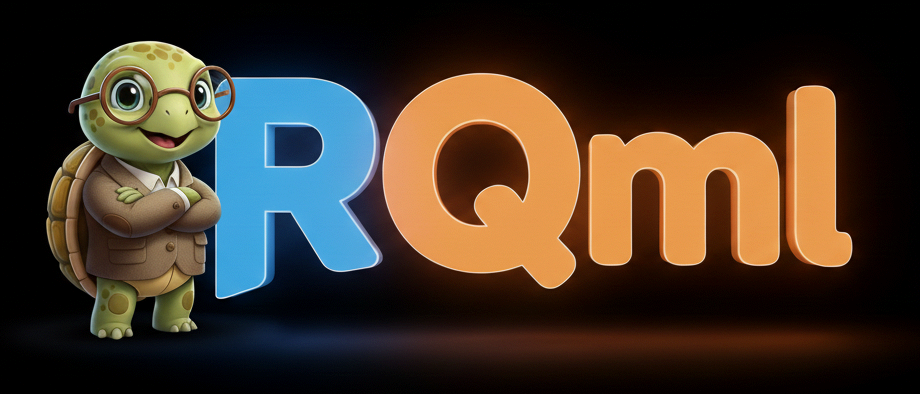

[](https://sonarcloud.io/summary/new_code?id=StefanFabian_rqml)
[](https://sonarcloud.io/summary/new_code?id=StefanFabian_rqml)
[](https://sonarcloud.io/summary/new_code?id=StefanFabian_rqml)
[](https://sonarcloud.io/summary/new_code?id=StefanFabian_rqml)



**RQml** is your modern, QML-based robotics debugging, introspection and control toolbox for ROS 2! 🚀

It provides a flexible, plugin-based architecture that empowers you to create your own custom plugins and control interfaces to inspect and debug your robotics applications, leveraging the full power of Qt 6 and QML. ✨

Built with [KDAB's KDDockWidgets](https://github.com/KDAB/KDDockWidgets), RQml offers a highly customizable docking interface, letting you arrange your workspace exactly how *you* like it. 🎨

## Support

You can support RQml by developing awesome plugins as described in [PLUGIN_DEVELOPMENT.md](PLUGIN_DEVELOPMENT.md).  
Alternatively, donations are always welcome :)

<a href="https://www.paypal.com/donate/?hosted_button_id=38X6FHSQ3WZAS"></a>

## ✨ Features

* 🔗 **ROS 2 Integration**: Seamlessly connects with the ROS 2 ecosystem using the [QML6 ROS2 Plugin](https://github.com/StefanFabian/qml6_ros2_plugin).
* 🖥️ **Modern UI**: Built on Qt 6 and QML for fluid, high-performance user interfaces.
* 🧩 **Plugin System**: Extensible architecture for easily adding new tools and widgets.
* 🪟 **Docking Interface**: Flexible layout management with KDDockWidgets.
* 🧰 **Default Plugins**: Comes with a suite of essential tools for robotics development.

## 🎬 Demo Video

https://github.com/user-attachments/assets/dc21676b-ed8f-4aa1-accd-fd5f4f7adeb0

## 📦 Installation

The easiest way to get started is to install RQml directly from the ROS buildfarm! **(Coming soon)**

```bash
sudo apt install ros-<distro>-rqml
```

*(Replace `<distro>` with your ROS 2 distribution, e.g., `humble`, `jazzy`)*

Alternatively, see **Building from Source**

## 🚀 Usage

Ready to go? Launch the application with a single command:

```bash
rqml
```

### 📐 Managing Layouts

RQml allows you to save and load your workspace configurations. Arrange your plugins to your heart's content and save the layout to restore it later! 💾

>[!NOTE]
> Use `Ctrl+Shift+S` to save your current config to one of the directories configured in the settings.
> Use `Ctrl+R` to quickly load one of your recently opened configurations or `Ctrl+O` to open
> a configuration from your config directories.

## 🔌 Default Plugins

The `rqml_default_plugins` package includes these awesome tools:

* **ActionCaller**: Interface for calling ROS 2 Actions.
* **Console**: A log viewer for ROS 2 messages.
* **ControllerManager**: Manage and switch ROS 2 controllers.
* **ControllerManagerStatistics**: Inspect statistics from ROS 2 controllers.
* **ImageView**: View camera streams and images.
* **JointTrajectoryController**: Interface for sending joint trajectory commands.
* **MessagePublisher**: Publish custom ROS 2 messages.
* **MoveItController**: Execute robot motions via MoveIt.
* **ParameterEditor**: Discover, view, and dynamically reconfigure ROS 2 node parameters.
* **RobotSteering**: Teleoperation tool for mobile robots.
* **ServiceCaller**: Interface for calling ROS 2 Services.
* **TfTreeViewer**: Visualize and search the TF frame tree.
* **TopicMonitor**: Monitor topic activity and bandwidth.

## 🧩 Creating your own plugin

See [PLUGIN_DEVELOPMENT.md](PLUGIN_DEVELOPMENT.md) on how to create a new plugin.
You can use the `rqml_plugin_example` as template.

## 🛠️ Building from Source

If you want to contribute or need the absolute latest changes, you can build from source:

1. **Create a ROS 2 workspace** (if you haven't already):
   ```bash
   mkdir -p ~/ros2_ws/src
   cd ~/ros2_ws/src
   ```

2. **Clone the repository**:
   ```bash
   git clone https://github.com/StefanFabian/qml6_ros2_plugin.git -b $ROS_DISTRO
   git clone https://github.com/StefanFabian/rqml.git
   ```
   This clones both this repository and the main dependency [QML6 ROS2 Plugin](https://github.com/StefanFabian/qml6_ros2_plugin).
   Currently, this plugin is not yet available on all distros.
   If it is available on yours, you may omit it but it could still be useful when developing.

3. **Install dependencies** (using rosdep):
   ```bash
   cd ~/ros2_ws
   rosdep install --from-paths src --ignore-src -r -y
   ```

4. **Build the workspace**:
   ```bash
   colcon build --symlink-install --packages-up-to rqml
   ```

5. **Source the workspace**:
   ```bash
   source install/setup.bash
   ```

## 📄 License

This project is licensed under the **GPLv3** License. ⚖️
